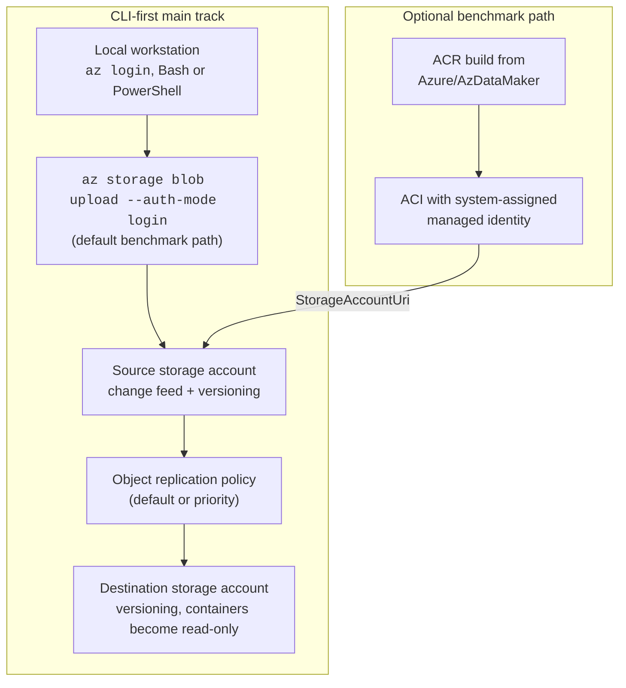
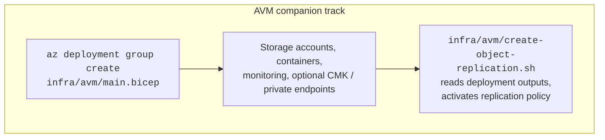

# Architecture — Multi-Region Non-Paired Azure Storage

## Overview

This repo demonstrates **Azure Blob Storage Object Replication** between non-paired regions and now documents **two complementary tracks**:

- a **CLI-first main track** for learning, benchmarking, and feature validation
- an **AVM companion track** for production-oriented storage provisioning with a separate replication-activation step

## Deployment tracks at a glance

| Track | Provisioning model | Benchmarking model | Best fit |
|---|---|---|---|
| **CLI-first main track** | Bash or PowerShell scripts in `scripts/` | Default: local file generation + `az storage blob upload --auth-mode login` Optional: AzDataMaker via ACR/ACI + managed identity | Feature demos, reproducible tests, quick setup |
| **AVM companion track** | `infra/avm/main.bicep` with `.bicepparam` files | No benchmark resources provisioned by default | Production-oriented foundation, secure defaults, change control |

## Naming and topology

- CLI storage account names come from `SOURCE_STORAGE` and `DEST_STORAGE` in [`config.env`](../config.env).
- If those values are blank, the CLI scripts derive stable names from the resource group hash, for example `objreplsrc736208` and `objrepldst736208`.
- Default container naming stays prefix-based: `source-01`, `source-02`, ... and `dest-01`, `dest-02`, ...
- The AVM companion is explicit instead of generated: `infra/avm/main.bicep` requires `sourceStorageAccountName` and `destinationStorageAccountName` parameters.

## Component diagram

## Data flows

### 1) CLI-first default flow

1. `01-create-storage.*` creates the resource group and the two storage accounts.
2. `02-enable-prereqs.*` enables **change feed** on the source and **blob versioning** on both accounts, then creates the source containers.
3. `bench-01-ingest-data.*` and `bench-02-continue-ingestion.*` generate files locally and upload them with `az storage blob upload --auth-mode login` unless you opt into AzDataMaker.
4. `03-setup-replication.*` creates destination containers, creates the first rule on the destination account, adds remaining rules, then creates the matching source-side policy.
5. `bench-03-monitor-replication.*` samples blob `replicationStatus` and reads Azure Monitor metrics.

Both Bash and PowerShell implement the same replication behavior, including:

- the same **copy-all** scope via `--min-creation-time '1601-01-01T00:00:00Z'`
- the same **destination-first** policy creation pattern
- the same **copy every configured container pair** flow

### 2) Optional AzDataMaker benchmark flow

When you pass `--use-azdatamaker` in Bash or `-UseAzDataMaker` / `--use-azdatamaker` in PowerShell:

1. the repo builds the container image from [`https://github.com/Azure/AzDataMaker.git`](https://github.com/Azure/AzDataMaker.git)
2. the image is stored in Azure Container Registry
3. Azure Container Instances are created with a **system-assigned managed identity**
4. each container receives `StorageAccountUri`
5. the ACI identity is granted **Storage Blob Data Contributor** on the **source storage account**
6. the ACI workload writes directly to the source containers

This is an optional scale-out benchmark path. It is **not** the default path anymore.

### 3) AVM companion flow

1. `infra/avm/main.bicep` provisions the storage foundation with AVM, source/destination containers, optional monitoring, optional CMK, and optional private endpoints.
2. `infra/avm/create-object-replication.sh` reads the deployment outputs and activates the object replication policy.
3. `Blog2.md` explains the design trade-offs, and `infra/avm/README.md` provides deployment instructions.

The separation between provisioning and activation is intentional. It gives operators a clear review point before the destination side becomes read-only.

## Security model

- The CLI-first track expects an authenticated Azure CLI session and uses **login-based** data-plane access for local uploads and blob inspection.
- The operator typically needs both management-plane rights (for deployment and policy configuration) and data-plane blob rights (for container creation, uploads, and inspection).
- The optional AzDataMaker path uses **managed identity**, not shared key, for storage access.
- The AVM companion defaults to `allowSharedKeyAccess=false`, disables blob public access, enforces HTTPS and TLS 1.2, and supports optional CMK and private endpoints.

## Operations model

Monitor at least these signals:

- `ObjectReplicationSourceBytesReplicated`
- `ObjectReplicationSourceOperationsReplicated`
- priority-mode pending metrics (`Operations pending for replication`, `Bytes pending for replication`)
- sampled blob `replicationStatus`
- blob service logs and storage metrics where available

Important operational caveats:

- destination containers become **read-only** while replication is active
- object replication is **async**, not a full application failover workflow
- cutover, failback, endpoint switching, DNS, and application permissions remain part of your broader DR design

## Platform constraints

- Only **block blobs** are replicated.
- Hierarchical namespace is **not supported** for object replication in this pattern.
- A source account can replicate to at most **two** destination accounts.
- Priority replication can be enabled on only **one policy per source account**.
- Cross-tenant replication requires explicit resource IDs and the corresponding cross-tenant settings.
